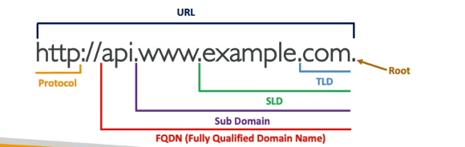

### Before getting into the Route 53, Let us understand About DNS, So that it will be easy to go through.

### What is DNS ?

- It stands for Domain Name System- Basically it translates the human friendly host names into the machine name IP address.
  i.e wwww.google.com ==> 172.124.18.34

- DNS is the backbone of the Internet

### DNS Terminologies

1.Domain Registrar : Amazon Rout 53, GoDaddy etc.
2.DNS Records : A,AAAA,CNAME,NS,....
3.Zone File : Contains DNS Records
4.Name Server : It resolves DNS Queries(Authoritative or Non Authoritative)
5.Top Level Domain (TLD) : .com, .ai, .in, .gov, .org.....
6.Second Level Domain(SLD) : amazon.com, google.com

### How DNS Works

The Domain Name System (DNS) is a fundamental component of the internet, acting as a bridge between human-readable domain names and machine-readable IP addresses. This system allows users to access websites using easy-to-remember domain names instead of complex numerical IP addresses.

### Basic Functionality

When a user types a domain name (e.g., www.example.com) into a web browser, the DNS translates this domain name into an IP address that computers use to locate and communicate with each other. This process is known as DNS resolution or DNS lookup.

### DNS Resolution Process

The DNS resolution process involves several steps and different types of DNS servers:

1. **User Request**: The user enters a domain name into the browser.
2. **Recursive DNS Query**: The browser sends a query to a recursive DNS resolver, typically managed by the user's Internet Service Provider (ISP).
3. **Cache Check**: The recursive resolver checks its cache to see if it has the IP address for the domain name. If found, it returns the IP address to the browser.
4. **Root Name Server**: If the IP address is not in the cache, the resolver queries a root name server.- Managed by ICANN
5. **TLD Name Server**: The root name server directs the query to a Top-Level Domain (TLD) name server (e.g., .com, .org). - Managed by IANA(Branch of ICANN)
6. **Authoritative Name Server**: The TLD name server directs the query to the authoritative name server for the specific domain, which holds the DNS records.
7. **IP Address Retrieval**: The authoritative name server returns the IP address to the recursive resolver.
8. **Response to Browser**: The recursive resolver sends the IP address back to the browser, which can then load the website.

### Types of DNS Servers

- **Recursive Resolver**: Acts as an intermediary, handling the initial query and performing the necessary steps to resolve it.
- **Root Name Server**: The first step in translating human-readable domain names into IP addresses, directing queries to the appropriate TLD name server.
- **TLD Name Server**: Manages domains within a specific top-level domain and directs queries to the authoritative name server.
- **Authoritative Name Server**: Holds the DNS records for a domain and provides the final IP address for the query.

### DNS Records

DNS records are stored in authoritative name servers and include various types:

- **A Record**: Maps a domain name to an IPv4 address.
- **CNAME Record**: Maps a domain name to another domain name.
- **MX Record**: Specifies the mail servers for a domain.
- **TXT Record**: Provides text information to sources outside the domain.
- **SRV Record**: Specifies services available for a domain.

### DNS Caching

To improve efficiency and reduce latency, DNS responses are often cached by the recursive resolver and the user's browser. This means that subsequent requests for the same domain can be resolved more quickly without querying the DNS servers again.

### DNS Propagation

When changes are made to DNS records, it takes time for these changes to propagate across all DNS servers globally. This period is known as DNS propagation and can take up to 48 hours.

### Security Considerations

DNS is susceptible to various attacks, such as DNS cache poisoning, where incorrect DNS data is inserted into the cache of a resolver, leading users to malicious sites. DNSSEC (DNS Security Extensions) is a suite of specifications to secure information provided by DNS.

In summary, DNS is a critical system that ensures users can access websites using domain names instead of IP addresses, involving a complex but efficient process of querying various DNS servers to resolve domain names into IP addresses

### What is Route 53

Amazon Route 53 is a scalable and highly available Domain Name System (DNS) web service provided by Amazon Web Services (AWS).

Here are some key points about Route 53:

1. It acts as an authoritative DNS service, allowing you to manage and route traffic for your domain names.

2. Route 53 was released on December 5, 2010 as part of AWS.

3. The name "Route 53" refers to the TCP/UDP port 53 used for DNS requests.

4. Key features include:

   - Global distribution of DNS servers for low latency
   - Automatic scaling to handle varying query loads
   - Support for both public and private DNS zones
   - Integration with other AWS services
   - Programmable API for DNS management
   - Health checks and failover routing options

5. Route 53 supports various DNS record types, including A, AAAA, CNAME, MX, and a proprietary "Alias" record type.

6. It offers multiple routing policies like simple, failover, geolocation, latency-based, and weighted routing.

7. Route 53 can be used for domain registration as well as DNS management.

8. Pricing is based on the number of hosted zones and DNS queries.

9. It provides a 100% availability SLA, which is not common among DNS providers.

10. Route 53 offers advantages over traditional registrar DNS services, including better performance, reliability, and advanced features like programmable APIs and traffic management policies.

Overall, Amazon Route 53 is a robust DNS service that offers more than just basic DNS resolution, making it a powerful tool for managing web traffic and improving application availability.
